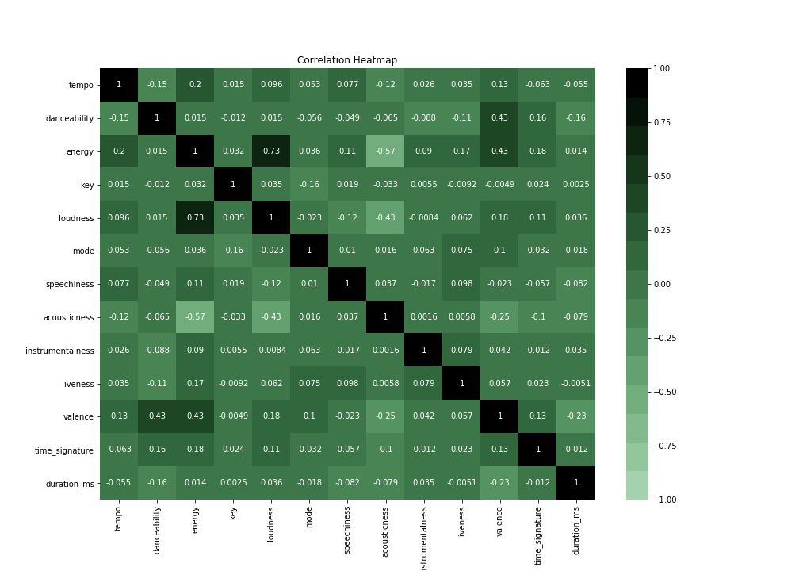
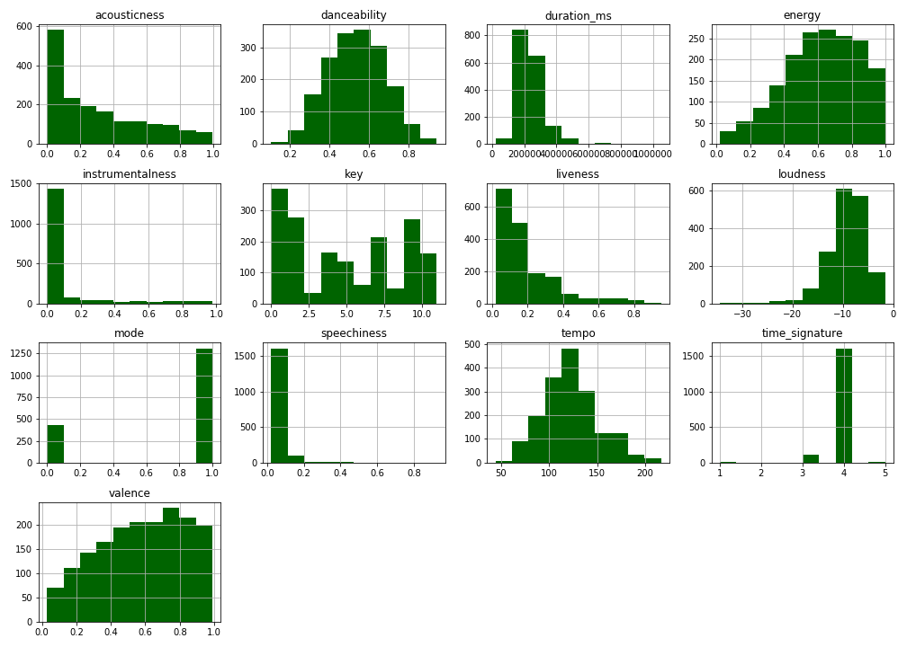
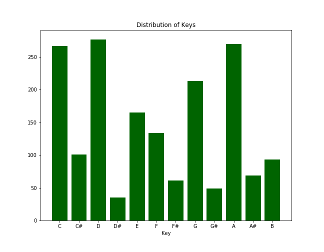
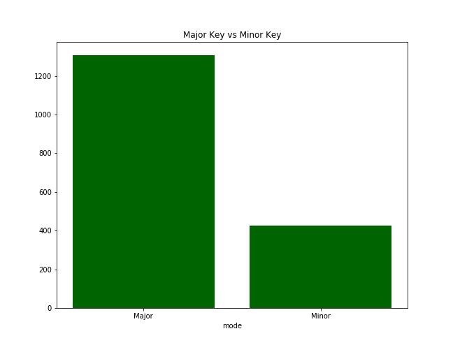
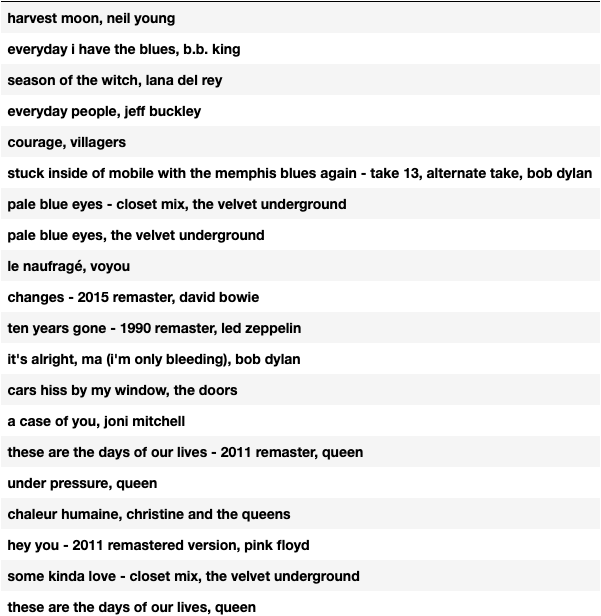

# The Perfect-Spotify-Playlist

***generating a playlist, based on a song, from your liked songs only!***

*Pegah Mirghafari*
___

## WHY?!

**“After that communism was the only answer for me, I thought. And if you can’t be a communist and make money you have to be a rock n roll star, at least in Hoboken. “ -Lou Reed**

My dream job would be working for Spotify as a data scientist since their product is the only product I can 100% get behind, **" and if I can't be a rock 'n' roll star and make money, then Spotify is the only answer for me, I thought; at least in Brooklyn."**
I knew right from the start that I will dedicate my most crucial project to rock n roll and Spotify. 
I was lost, however,  as to what I wanted to do. What is not done yet?. One day when for the 100th time someone asked me for my Spotify playlist, I found myself having to explain once again why I do not have any playlists. 
The truth of the matter is that liking a song is straightforward on Spotify. I can do it in less than a second, but making a playlist is an art or a dire project on its own, one that I was dreading to tackle. Where should I start? There are MANY ways I could categorize my liked songs and make a playlist based on a song's mood, similarity amongst artists, their genres, language, decade, story, and thousands of other ways that I cannot even imagine. Too many options always crippled my decision-making abilities, and now I was left with more than two thousand songs in my playlist that I played on shuffle. They would change my mood from a hopeless romantic to just mindlessly dancing, and that was only half of it.  
Then, I remembered the time I was listening to "Going to California" by Led Zeppelin while driving home. I was lost in the lyrics and the tempo of the song and had turned my volume very high. The song came to an end, and the red lights turned green, all while the next music played on HIGH VOLUME, John Bon Jovi, screaming: 
**"SHOT THROUGH THE HEART, AND YOU'RE TO BLAME, DARLING, YOU GIVE LOVE A BAD NAME."**
If one listens to "you give love a bad name," on its own, on high volume, one might enjoy it. But when you're lost in the dreams of "going to California, the last thing you want is Bon Jovi accusing you of giving love a bad name. It could give you a heart attack! 
That was it! This is my destiny! This is why it was brought here on earth!!! I need to automate Spotify to make various playlists on my liked songs, and like songs alone, and do it fast, because while I like to pretend that I am an open-minded person, I have to admit I'm close-minded when it comes to music! I only listen to the 2000 songs I've liked, occasionally adding one or two to the collection. Besides, creating a playlist seems like such a daunting task. Either I would get too distracted and end up with a five-song playlist, or I would lay in my bed static upon waking up, dedicating 10 hours to the task. Either way, I would wind up frustrated. 
### So here it is, an app that takes YOUR liked songs and creates a 20-song playlist for you, based on any music you choose! The first ten are in ascending order of tempo, and the next then in descending order, because *WHAT GOSE UP MUST COME DOWN -Isaac Newton(probably).*  
___

## Index:
- [Data Dictionary](#Data-Dictionary)
- [Exploratory Data Analysis](#Exploratory-Data-Analysis)
- [Preprocessing](#Preprocessing)
- [Recommender](#Recommender)
- [Next Steps](#Next-Steps)
    
___

## Data Dictionary:
 
The data scraped for this project was from my own personal spotify liked songs.  

|Feature|Type|Description|
|---|---|---|
|danceability|float|Danceability describes how suitable a track is for dancing based on a combination of musical elements including tempo, rhythm stability, beat strength, and overall regularity. A value of 0.0 is least danceable and 1.0 is most danceable.|
|energy|float|Energy is a measure from 0.0 to 1.0 and represents a perceptual measure of intensity and activity. Typically, energetic tracks feel fast, loud, and noisy. For example, death metal has high energy, while a Bach prelude scores low on the scale. Perceptual features contributing to this attribute include dynamic range, perceived loudness, timbre, onset rate, and general entropy.|
|key|float|The key music is written in. Integers map to pitches using standard [Pitch Class Notation](https://en.wikipedia.org/wiki/Pitch_class) . E.g. 0 = C, 1 = C♯/D♭, 2 = D, and so on.|
|loudness|float|The overall loudness of a track in decibels (dB). Loudness values are averaged across the entire track and are useful for comparing relative loudness of tracks. Loudness is the quality of a sound that is the primary psychological correlate of physical strength (amplitude). Values typical range between -60 and 0 db.|
|mode|int|Mode indicates the modality (major or minor) of a track, the type of scale from which its melodic content is derived. Major is represented by 1 and minor is 0.|
|speechiness|float|Speechiness detects the presence of spoken words in a track. The more exclusively speech-like the recording (e.g. talk show, audio book, poetry), the closer to 1.0 the attribute value. Values above 0.66 describe tracks that are probably made entirely of spoken words. Values between 0.33 and 0.66 describe tracks that may contain both music and speech, either in sections or layered, including such cases as rap music. Values below 0.33 most likely represent music and other non-speech-like tracks.|
|acousticness|float|A confidence measure from 0.0 to 1.0 of whether the track is acoustic. 1.0 represents high confidence the track is acoustic.|
|instrumentalness|float|Predicts whether a track contains no vocals. “Ooh” and “aah” sounds are treated as instrumental in this context. Rap or spoken word tracks are clearly “vocal”. The closer the instrumentalness value is to 1.0, the greater likelihood the track contains no vocal content. Values above 0.5 are intended to represent instrumental tracks, but confidence is higher as the value approaches 1.0.|
|liveness|float|Detects the presence of an audience in the recording. Higher liveness values represent an increased probability that the track was performed live. A value above 0.8 provides strong likelihood that the track is live.|
|valence|float|A measure from 0.0 to 1.0 describing the musical positiveness conveyed by a track. Tracks with high valence sound more positive (e.g. happy, cheerful, euphoric), while tracks with low valence sound more negative (e.g. sad, depressed, angry).|
|tempo|float|The overall estimated tempo of a track in beats per minute (BPM). In musical terminology, tempo is the speed or pace of a given piece and derives directly from the average beat duration.|
|duration_ms|int|Duration of song in milliseconds.|
|time_signature|int|An estimated overall time signature of a track. The time signature (meter) is a notational convention to specify how many beats are in each bar (or measure).|
|uri|Object|Spotify's unique identfier for the track. Entering this id into Spotify's search will bring you directly to that specific track.|

  

Descriptions were taken from the official documentation at Spotify's Developer website [here](https://developer.spotify.com/documentation/web-api/reference/tracks/get-several-audio-features/). They desplay the distribution of the metrics.
___

## Exploratory Data Analysis

  

**Analysis:**  
- danceability has a high correlation with valence (how happy a song is), but no other significant relations with any other features, not even the tempo, which is interesting to see. Danceability seems to have a negative correlation with tempo!
- energy seems to be directly correlated with higher valence. Songs that are higher in energy also seem to be VERY LOUD! And it looks like they have a very antagonistic relationship with causticness, meaning increased energy songs are not acoustic and acoustic songs are low in energy!
- to my surprise, the tempo doesn't seem to be highly correlated to danceability, energy, or the valence of the song. However, songs with higher beat seem to be just moderately related to its time-signature. I was expecting a much stronger correlation.
- duration seems to have the most negative correlation with other features; most notables are valance and danceability. I though duration and liveness would have a positive correlation, since live performances tend to have a monolog before or after the performance, or could have a more extended guitar solo.
- acoustic ness seems to have a negative correlation with many of the features, most notably with loudness and energy.
Key, mode, speechiness, instrumentalsness, liveness seem to have NO EFFECT on the rest of the features.

 
**Analysis:** 
- speechiness, instrumentalness, duration liveness, and loudness all seem to have outliers!
-danceability and tempo seem to have a very regular distribution. It is worth mentioning that some of the other features seem to fall under categorical variables, *, i.e., mode, key, time-sig.*
-  liveliness and acoustic-sessions are right-skewed; however, the latter seems to have an outlier. Valence and energy are left-skewed, meaning they are more happy and higher energy songs in my liked songs!

 

**Analysis:** 

- there seems to be very little music made in the minor keys

***for more analytics go to the [EDA notebook](https://github.com/pegahmirghafari/perfect-spotify-playlist/blob/main/02_EDA.ipynb)***
 
  

___
## Preprocessing
  
by adding the name of the artist to the song, and lower-casing them I will save myself some headache.
I will keep the uri to later search songs on spotify wit it and add them to the playlist

### Standard Scaling
The name-artist column is the index, and by dropping the URI, I only have numeric data. Standard scaler my data, assuring that each column will have a μ = 0 and σ = 1; in simple English, it means they are now all on the same scale!

### Cosine Similarity
Now I'm going to use cosine similarity from sklearn; this is a measure of similarity between two non-zero vectors by measuring the cosign of the angle between them. As we know, the cosine of 0° and 180° are 1 and -1, respectively, and cosine of any other angle falls between the two, with the cosine of 90° and 270° are both 0. therefore, we are comparing the position of each vector along the circle. This means the two most similar items will have an identical orientation and cosine similarity of close. Two things that have a 90° angle between their orientation will have a cosine similarity of 0. If they have a cosine similarity of -1, then they are on the opposite sides of the spectrum and will therefore have a 180° angle between them.
For this recommendation system, we are assuming that each song is it's own vector, with unique features; we will create a recommendation system by comparing each piece (vector) to every other song in a big matrix.

## Recommender 
- the recommendations are generated based on track features. 
- this will assure that the songs in the playlist are musically similar, which is what I was hoping for. 
- I do not wish the recommender to be 100% accurate, as I don't want to end up with a playlist of the same song on repeat.
- for what it's worth and considering how small my data frame was this these are spot on recommendations
**here is a list of songs I got recommended based on ***Harvest Moon, Neil Young'***.**

***to see the playlist [click here](https://open.spotify.com/playlist/5EFb1rNuaqHGh1SL5WpE0o)***

  

___
## Next Steps
  

- the very first thing I will do is create a flask app. 
- then create a UI with react.
- lastly, I will host the app on a Heroku server since I enjoyed it, and I believe others could enjoy it as well. ***especially my friends*** 
